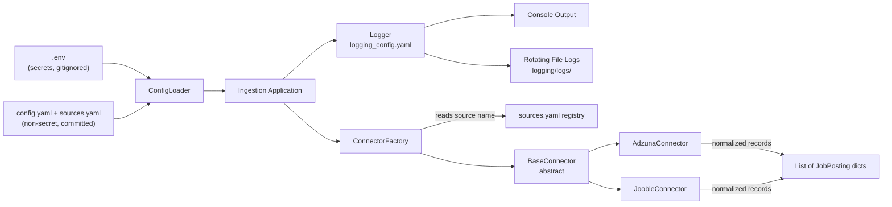

# Job Market Analytics Platform
## Chapter 2: Configuration Management, Logging Framework & the Ingestion Connector Pattern

> **Recap:** Chapter 1 gave us the architecture and folder skeleton. This chapter builds the three foundations everything else depends on: (1) a config system that keeps secrets out of code, (2) a production logging framework, and (3) a connector abstraction so adding a new job-board API means writing one small class, not another standalone script.

---

## 1. Theory

### 1.1 Why configuration management is a "real" engineering concern, not busywork

Junior code hardcodes `app_id = "abc123"` at the top of a script. Production code never does this, for three reasons an interviewer will probe:

1. **Security** — secrets in source code end up in git history forever, even if you delete them later. GitHub's secret-scanning bots find leaked API keys within minutes of a push.
2. **Environment portability** — the same code must run in local dev, CI (GitHub Actions), and Fabric, each with different credential sources.
3. **Change without redeploy** — a rate limit or endpoint URL changing shouldn't require a code change and PR review; it should be a config edit.

The standard pattern (used at Microsoft, Databricks, and virtually every serious data team) is the **12-factor app** principle: strict separation between:
- **Non-secret settings** → checked into git as YAML (`config.yaml`, `sources.yaml`)
- **Secrets** → environment variables, loaded from `.env` locally (gitignored) and from a secret store (Azure Key Vault, GitHub Secrets, Fabric workspace secrets) in deployed environments.

### 1.2 Why a connector abstraction (not per-source scripts)

Without an abstraction, adding "USAJobs" as a third source means copy-pasting `adzuna_connector.py`, renaming things, and quietly introducing three small bugs. With an abstraction:

- `base_connector.py` defines **what every source must do**: authenticate, fetch, normalize into a common schema, handle pagination, handle rate limits.
- Each concrete connector (`AdzunaConnector`, `JoobleConnector`) implements only what's *different* about that API.
- The orchestration layer (Chapter 6) never needs to know which API it's calling — it just calls `.fetch()` on whatever connector `sources.yaml` tells it to instantiate.

This is the same design pattern behind Airbyte, Fivetran, and Meltano source plugins. Naming it correctly in an interview ("I used the Strategy/Template Method pattern for pluggable connectors") is a strong signal.

### 1.3 Why logging is a designed system, not `print()`

Production logging needs to answer, months later: *what happened, when, in which run, and why did it fail?* That requires:
- **Structured, leveled logs** (DEBUG/INFO/WARNING/ERROR/CRITICAL) — not everything is worth an alert.
- **Run correlation** — every log line from one pipeline execution should be traceable to that run (a `run_id`).
- **Both console and file output** — console for local dev, rotating files for anything that runs unattended (Fabric notebooks, GitHub Actions).
- **No secrets in logs** — a shockingly common real-world data breach vector is API keys accidentally logged during error handling.

---

## 2. Architecture



**Flow in words:** `ConfigLoader` merges `.env` secrets with `config.yaml`/`sources.yaml` non-secret settings into one immutable config object. `ConnectorFactory` reads `sources.yaml`, looks up which class implements each source, and instantiates it with the merged config. Every connector inherits retry logic, logging, and error handling from `BaseConnector`, so `AdzunaConnector`/`JoobleConnector` only implement API-specific request-building and response-parsing.

---

## 3. Folder Structure (additions this chapter)

```
JobMarketAnalytics/
├── .env.example                     # NEW
├── config/
│   ├── config.yaml                  # NEW
│   ├── sources.yaml                 # NEW
│   └── logging_config.yaml          # NEW
├── ingestion/
│   ├── __init__.py                  # NEW
│   ├── base_connector.py            # NEW
│   ├── adzuna_connector.py          # NEW
│   ├── jooble_connector.py          # NEW
│   ├── connector_factory.py         # NEW
│   └── run_ingestion.py             # NEW (entry point)
├── utils/
│   ├── __init__.py                  # NEW
│   ├── config_loader.py             # NEW
│   └── logger.py                    # NEW
└── tests/
    └── unit/
        └── test_connector_factory.py # NEW
```

---

## 4. Complete Code

### 4.1 `.env.example`

```bash
# Copy this file to .env and fill in real values. NEVER commit .env itself.

# Adzuna API — https://developer.adzuna.com/
ADZUNA_APP_ID=your_app_id_here
ADZUNA_APP_KEY=your_app_key_here

# Jooble API — https://jooble.org/api/about
JOOBLE_API_KEY=your_jooble_key_here

# Environment: local | ci | fabric
APP_ENV=local

# Optional: Azure Key Vault (used in Chapter 6 deployment, not required locally)
AZURE_KEY_VAULT_URL=
```

### 4.2 `config/config.yaml`

```yaml
# Non-secret application configuration.
# Secrets referenced here (e.g. ${ADZUNA_APP_ID}) are resolved from environment variables at runtime.

app:
  name: job-market-analytics
  environment: ${APP_ENV:local}   # default "local" if APP_ENV unset

storage:
  # Local dev writes to disk; Fabric/prod writes to OneLake/ADLS paths.
  bronze_path: "data/bronze"
  silver_path: "data/silver"
  gold_path: "data/gold"
  # Fabric equivalent (used from Chapter 3 onward):
  # bronze_path: "Tables/bronze"

ingestion:
  default_country: "us"
  results_per_page: 50
  max_pages_per_run: 5          # caps API usage to respect free-tier limits
  request_timeout_seconds: 15
  max_retries: 3
  retry_backoff_seconds: 2       # exponential: 2s, 4s, 8s

logging:
  config_file: "config/logging_config.yaml"
  log_dir: "logging/logs"
```

### 4.3 `config/sources.yaml`

```yaml
# Registry of all ingestion sources. Adding a new API = one entry here + one connector class.
# The "class" field maps to ConnectorFactory's registry in connector_factory.py.

sources:
  - name: adzuna
    enabled: true
    class: AdzunaConnector
    base_url: "https://api.adzuna.com/v1/api/jobs"
    auth:
      app_id_env: ADZUNA_APP_ID
      app_key_env: ADZUNA_APP_KEY
    countries: ["us", "gb"]

  - name: jooble
    enabled: true
    class: JoobleConnector
    base_url: "https://jooble.org/api"
    auth:
      api_key_env: JOOBLE_API_KEY
    countries: ["us"]

  - name: usajobs
    enabled: false               # scaffolded but off by default (Chapter 1, optional source)
    class: UsaJobsConnector
    base_url: "https://data.usajobs.gov/api/search"
    auth:
      api_key_env: USAJOBS_API_KEY
    countries: ["us"]
```

### 4.4 `config/logging_config.yaml`

```yaml
version: 1
disable_existing_loggers: false

formatters:
  standard:
    format: "%(asctime)s | %(levelname)-8s | run_id=%(run_id)s | %(name)s | %(message)s"
    datefmt: "%Y-%m-%d %H:%M:%S"

filters:
  run_id_filter:
    (): utils.logger.RunIdFilter

handlers:
  console:
    class: logging.StreamHandler
    level: INFO
    formatter: standard
    filters: [run_id_filter]
    stream: ext://sys.stdout

  file:
    class: logging.handlers.RotatingFileHandler
    level: DEBUG
    formatter: standard
    filters: [run_id_filter]
    filename: "logging/logs/pipeline.log"
    maxBytes: 5242880   # 5 MB
    backupCount: 5
    encoding: utf8

root:
  level: DEBUG
  handlers: [console, file]
```

### 4.5 `utils/logger.py`

```python
"""
Production logging setup for the Job Market Analytics Platform.

Design goals:
- Every log line is tagged with a run_id so a single pipeline execution's
  logs can be grepped out of a shared log file.
- Console gets INFO+, file gets DEBUG+ (verbose history without noisy console).
- Configuration lives in YAML, not hardcoded, so ops can change log levels
  without touching Python code.
"""

from __future__ import annotations

import logging
import logging.config
import os
import uuid
from pathlib import Path

import yaml

# One run_id per process. Every log line in a single ingestion run shares this ID.
_RUN_ID = str(uuid.uuid4())[:8]


class RunIdFilter(logging.Filter):
    """Injects the process-wide run_id into every log record."""

    def filter(self, record: logging.LogRecord) -> bool:
        record.run_id = _RUN_ID
        return True


def get_run_id() -> str:
    return _RUN_ID


def setup_logging(config_path: str = "config/logging_config.yaml") -> None:
    """
    Loads logging_config.yaml and configures the root logger.
    Creates the log directory if it doesn't exist (RotatingFileHandler
    does not create parent directories automatically).
    """
    config_file = Path(config_path)
    if not config_file.exists():
        # Fail safe: fall back to basic console logging rather than crashing
        # the whole pipeline just because a log config is missing.
        logging.basicConfig(level=logging.INFO)
        logging.getLogger(__name__).warning(
            "Logging config not found at %s — using basicConfig fallback.",
            config_path,
        )
        return

    with open(config_file, "r", encoding="utf-8") as f:
        config = yaml.safe_load(f)

    # Ensure the log directory exists before handlers try to open files in it.
    log_filename = config.get("handlers", {}).get("file", {}).get("filename")
    if log_filename:
        Path(log_filename).parent.mkdir(parents=True, exist_ok=True)

    logging.config.dictConfig(config)


def get_logger(name: str) -> logging.Logger:
    """Standard entry point every module should use: logger = get_logger(__name__)"""
    return logging.getLogger(name)
```

**Note on `RunIdFilter` registration:** the YAML references it as `(): utils.logger.RunIdFilter` — Python's `logging.config.dictConfig` supports instantiating arbitrary callables this way, which is why the filter class lives in this module rather than being redefined per-config.

### 4.6 `utils/config_loader.py`

```python
"""
Merges non-secret YAML config with secret environment variables into a single,
read-only configuration object. This is the ONLY module allowed to read
os.environ directly for API credentials — every other module receives
credentials already resolved, so secrets are never scattered across the codebase.
"""

from __future__ import annotations

import os
import re
from dataclasses import dataclass, field
from pathlib import Path
from typing import Any

import yaml
from dotenv import load_dotenv

_ENV_VAR_PATTERN = re.compile(r"\$\{(\w+)(?::([^}]*))?\}")


class ConfigError(Exception):
    """Raised when required configuration or secrets are missing."""


def _resolve_env_placeholders(value: Any) -> Any:
    """
    Recursively resolves ${VAR_NAME} and ${VAR_NAME:default} placeholders
    found inside YAML string values using environment variables.
    """
    if isinstance(value, str):
        def replace(match: re.Match) -> str:
            var_name, default = match.group(1), match.group(2)
            resolved = os.environ.get(var_name, default)
            if resolved is None:
                raise ConfigError(
                    f"Environment variable '{var_name}' is required but not set, "
                    f"and no default was provided in config."
                )
            return resolved

        return _ENV_VAR_PATTERN.sub(replace, value)

    if isinstance(value, dict):
        return {k: _resolve_env_placeholders(v) for k, v in value.items()}

    if isinstance(value, list):
        return [_resolve_env_placeholders(v) for v in value]

    return value


@dataclass(frozen=True)
class AppConfig:
    """Immutable, fully-resolved application configuration."""

    raw: dict = field(repr=False)

    def get(self, *keys: str, default: Any = None) -> Any:
        """Safe nested lookup: config.get('ingestion', 'max_retries')"""
        node = self.raw
        for key in keys:
            if not isinstance(node, dict) or key not in node:
                return default
            node = node[key]
        return node


def load_config(
    config_path: str = "config/config.yaml",
    sources_path: str = "config/sources.yaml",
    env_file: str = ".env",
) -> AppConfig:
    """
    Loads .env into the process environment, then loads and merges
    config.yaml + sources.yaml, resolving ${ENV_VAR} placeholders.

    Raises ConfigError if a required file is missing or an env var
    referenced without a default is unset.
    """
    if Path(env_file).exists():
        load_dotenv(env_file)

    merged: dict = {}
    for path in (config_path, sources_path):
        p = Path(path)
        if not p.exists():
            raise ConfigError(f"Required config file not found: {path}")
        with open(p, "r", encoding="utf-8") as f:
            data = yaml.safe_load(f) or {}
        merged.update(data)

    resolved = _resolve_env_placeholders(merged)
    return AppConfig(raw=resolved)


def get_source_credential(source_config: dict, key_name: str) -> str:
    """
    Resolves a specific credential for a source entry in sources.yaml,
    e.g. get_source_credential(source_cfg, 'app_key_env') -> actual API key value.
    Raises ConfigError with a clear message if the env var is missing —
    this is deliberately verbose because a silent None credential produces
    a confusing 401 error three layers downstream instead.
    """
    env_var_name = source_config.get("auth", {}).get(key_name)
    if not env_var_name:
        raise ConfigError(f"No '{key_name}' configured in sources.yaml auth block.")
    value = os.environ.get(env_var_name)
    if not value:
        raise ConfigError(
            f"Environment variable '{env_var_name}' is not set. "
            f"Did you copy .env.example to .env and fill in real credentials?"
        )
    return value
```

### 4.7 `ingestion/base_connector.py`

```python
"""
Abstract base class every job-board connector must implement.

Design pattern: Template Method. fetch() defines the fixed algorithm
(paginate -> request -> parse -> normalize -> accumulate), while subclasses
only implement the API-specific pieces: _build_request(), _parse_response(),
and _has_more_pages().

This means retry logic, timeout handling, and logging are written ONCE here
and inherited by every connector — a new source cannot "forget" to implement
retries because it's not their responsibility to.
"""

from __future__ import annotations

import time
from abc import ABC, abstractmethod
from dataclasses import dataclass, field
from datetime import datetime, timezone
from typing import Any

import requests

from utils.config_loader import AppConfig
from utils.logger import get_logger, get_run_id

logger = get_logger(__name__)


class ConnectorError(Exception):
    """Raised when a connector exhausts retries or receives an unrecoverable response."""


@dataclass
class JobPosting:
    """
    Common normalized schema every connector must map its source's response into.
    This is what gets written to Bronze — NOT the raw API response — because
    even Bronze needs a minimally consistent shape to be queryable, while still
    preserving the full raw payload for audit purposes.
    """
    source: str
    source_job_id: str
    title: str
    company: str | None
    location_raw: str | None
    country: str | None
    description: str | None
    salary_min: float | None
    salary_max: float | None
    currency: str | None
    remote: bool | None
    posted_date: str | None
    url: str | None
    ingestion_timestamp: str = field(
        default_factory=lambda: datetime.now(timezone.utc).isoformat()
    )
    run_id: str = field(default_factory=get_run_id)
    raw_payload: dict = field(default_factory=dict)


class BaseConnector(ABC):
    def __init__(self, source_config: dict, app_config: AppConfig):
        self.source_config = source_config
        self.app_config = app_config
        self.source_name = source_config["name"]
        self.max_retries = app_config.get("ingestion", "max_retries", default=3)
        self.backoff_seconds = app_config.get(
            "ingestion", "retry_backoff_seconds", default=2
        )
        self.timeout = app_config.get(
            "ingestion", "request_timeout_seconds", default=15
        )
        self.max_pages = app_config.get(
            "ingestion", "max_pages_per_run", default=5
        )

    # ---- Fixed algorithm (Template Method) -----------------------------

    def fetch(self, country: str) -> list[JobPosting]:
        """
        Paginated fetch with retry-on-failure. Returns normalized JobPosting
        records. Individual page failures after max_retries are logged and
        skipped rather than aborting the entire run — partial data beats no
        data for a daily ingestion job.
        """
        all_postings: list[JobPosting] = []
        page = 1

        while page <= self.max_pages:
            try:
                response_json = self._request_with_retry(country=country, page=page)
            except ConnectorError:
                logger.error(
                    "[%s] Giving up on page %d after %d retries — skipping remaining pages.",
                    self.source_name, page, self.max_retries,
                )
                break

            postings = self._parse_response(response_json, country=country)
            all_postings.extend(postings)
            logger.info(
                "[%s] country=%s page=%d fetched=%d records (running total=%d)",
                self.source_name, country, page, len(postings), len(all_postings),
            )

            if not self._has_more_pages(response_json, page):
                break
            page += 1

        return all_postings

    def _request_with_retry(self, country: str, page: int) -> dict:
        last_exception: Exception | None = None

        for attempt in range(1, self.max_retries + 1):
            try:
                url, params = self._build_request(country=country, page=page)
                response = requests.get(url, params=params, timeout=self.timeout)
                response.raise_for_status()
                return response.json()

            except requests.exceptions.RequestException as exc:
                last_exception = exc
                wait = self.backoff_seconds * (2 ** (attempt - 1))
                logger.warning(
                    "[%s] Request failed (attempt %d/%d): %s — retrying in %ds",
                    self.source_name, attempt, self.max_retries, exc, wait,
                )
                if attempt < self.max_retries:
                    time.sleep(wait)

        raise ConnectorError(
            f"[{self.source_name}] Exhausted {self.max_retries} retries. "
            f"Last error: {last_exception}"
        )

    # ---- Subclass-specific pieces ---------------------------------------

    @abstractmethod
    def _build_request(self, country: str, page: int) -> tuple[str, dict[str, Any]]:
        """Returns (url, query_params) for this API/page."""
        raise NotImplementedError

    @abstractmethod
    def _parse_response(self, response_json: dict, country: str) -> list[JobPosting]:
        """Maps this API's raw response shape into a list of JobPosting."""
        raise NotImplementedError

    @abstractmethod
    def _has_more_pages(self, response_json: dict, current_page: int) -> bool:
        """Returns whether another page should be fetched."""
        raise NotImplementedError
```

### 4.8 `ingestion/adzuna_connector.py`

```python
"""
Adzuna API connector. Docs: https://developer.adzuna.com/docs/search

Adzuna paginates via 'page' in the URL path itself and reports total result
count, so _has_more_pages compares cumulative fetched count against 'count'.
"""

from __future__ import annotations

from typing import Any

from ingestion.base_connector import BaseConnector, JobPosting
from utils.config_loader import get_source_credential
from utils.logger import get_logger

logger = get_logger(__name__)


class AdzunaConnector(BaseConnector):

    def _build_request(self, country: str, page: int) -> tuple[str, dict[str, Any]]:
        app_id = get_source_credential(self.source_config, "app_id_env")
        app_key = get_source_credential(self.source_config, "app_key_env")
        base_url = self.source_config["base_url"]

        # Adzuna's REST path includes country + page: /jobs/{country}/search/{page}
        url = f"{base_url}/{country}/search/{page}"
        params = {
            "app_id": app_id,
            "app_key": app_key,
            "results_per_page": self.app_config.get(
                "ingestion", "results_per_page", default=50
            ),
            "content-type": "application/json",
        }
        return url, params

    def _parse_response(self, response_json: dict, country: str) -> list[JobPosting]:
        results = response_json.get("results", [])
        postings: list[JobPosting] = []

        for item in results:
            try:
                postings.append(
                    JobPosting(
                        source="adzuna",
                        source_job_id=str(item.get("id")),
                        title=item.get("title", "").strip(),
                        company=(item.get("company") or {}).get("display_name"),
                        location_raw=(item.get("location") or {}).get("display_name"),
                        country=country,
                        description=item.get("description"),
                        salary_min=item.get("salary_min"),
                        salary_max=item.get("salary_max"),
                        currency=item.get("salary_currency") or None,
                        remote=None,  # Adzuna doesn't expose this directly; derived in Silver
                        posted_date=item.get("created"),
                        url=item.get("redirect_url"),
                        raw_payload=item,
                    )
                )
            except Exception as exc:
                # A single malformed record should not kill the whole page.
                logger.warning(
                    "[adzuna] Skipping malformed record id=%s: %s",
                    item.get("id", "unknown"), exc,
                )

        return postings

    def _has_more_pages(self, response_json: dict, current_page: int) -> bool:
        total_available = response_json.get("count", 0)
        results_per_page = self.app_config.get(
            "ingestion", "results_per_page", default=50
        )
        return current_page * results_per_page < total_available
```

### 4.9 `ingestion/jooble_connector.py`

```python
"""
Jooble API connector. Docs: https://jooble.org/api/about

Jooble is POST-based (unusual vs. most REST job APIs) and paginates via a
'page' field in the JSON body rather than the URL, so _build_request returns
a POST-style params dict that run_ingestion.py's requester needs to send as
a JSON body, not query params. We handle that by overriding the request
mechanics minimally rather than forcing GET semantics onto a POST API.
"""

from __future__ import annotations

from typing import Any

import requests

from ingestion.base_connector import BaseConnector, ConnectorError, JobPosting
from utils.config_loader import get_source_credential
from utils.logger import get_logger

logger = get_logger(__name__)


class JoobleConnector(BaseConnector):
    """
    Overrides _request_with_retry because Jooble requires POST + JSON body,
    while BaseConnector's default implementation assumes GET + query params.
    This is a deliberate, minimal override — everything else (retry/backoff/
    logging) is reused from the parent via super().
    """

    def _build_request(self, country: str, page: int) -> tuple[str, dict[str, Any]]:
        api_key = get_source_credential(self.source_config, "api_key_env")
        base_url = self.source_config["base_url"]
        url = f"{base_url}/{api_key}"
        body = {
            "keywords": "",       # empty = all job categories
            "location": country,
            "page": str(page),
        }
        return url, body

    def _request_with_retry(self, country: str, page: int) -> dict:
        import time

        last_exception: Exception | None = None
        url, body = self._build_request(country=country, page=page)

        for attempt in range(1, self.max_retries + 1):
            try:
                response = requests.post(url, json=body, timeout=self.timeout)
                response.raise_for_status()
                return response.json()
            except requests.exceptions.RequestException as exc:
                last_exception = exc
                wait = self.backoff_seconds * (2 ** (attempt - 1))
                logger.warning(
                    "[jooble] Request failed (attempt %d/%d): %s — retrying in %ds",
                    attempt, self.max_retries, exc, wait,
                )
                if attempt < self.max_retries:
                    time.sleep(wait)

        raise ConnectorError(
            f"[jooble] Exhausted {self.max_retries} retries. Last error: {last_exception}"
        )

    def _parse_response(self, response_json: dict, country: str) -> list[JobPosting]:
        results = response_json.get("jobs", [])
        postings: list[JobPosting] = []

        for item in results:
            try:
                postings.append(
                    JobPosting(
                        source="jooble",
                        source_job_id=str(item.get("id", item.get("link", ""))),
                        title=(item.get("title") or "").strip(),
                        company=item.get("company"),
                        location_raw=item.get("location"),
                        country=country,
                        description=item.get("snippet"),
                        salary_min=None,   # Jooble returns salary as free text, parsed in Silver
                        salary_max=None,
                        currency=None,
                        remote=None,
                        posted_date=item.get("updated"),
                        url=item.get("link"),
                        raw_payload=item,
                    )
                )
            except Exception as exc:
                logger.warning("[jooble] Skipping malformed record: %s", exc)

        return postings

    def _has_more_pages(self, response_json: dict, current_page: int) -> bool:
        total_available = response_json.get("totalCount", 0)
        results_per_page = self.app_config.get(
            "ingestion", "results_per_page", default=50
        )
        return current_page * results_per_page < total_available
```

### 4.10 `ingestion/connector_factory.py`

```python
"""
Instantiates the correct connector class based on sources.yaml, without the
caller needing to know concrete class names. This is what lets orchestration
code (Chapter 6) say "run all enabled sources" without an if/elif chain.
"""

from __future__ import annotations

from ingestion.adzuna_connector import AdzunaConnector
from ingestion.base_connector import BaseConnector
from ingestion.jooble_connector import JoobleConnector
from utils.config_loader import AppConfig, ConfigError

# Explicit registry (no dynamic getattr/importlib magic) — deliberately
# simple and greppable over "clever". Add a new connector = add one line here.
_CONNECTOR_REGISTRY: dict[str, type[BaseConnector]] = {
    "AdzunaConnector": AdzunaConnector,
    "JoobleConnector": JoobleConnector,
}


def build_enabled_connectors(app_config: AppConfig) -> list[BaseConnector]:
    """Returns instantiated connector objects for every source with enabled: true."""
    sources = app_config.get("sources", default=[])
    connectors: list[BaseConnector] = []

    for source_cfg in sources:
        if not source_cfg.get("enabled", False):
            continue

        class_name = source_cfg.get("class")
        connector_cls = _CONNECTOR_REGISTRY.get(class_name)
        if connector_cls is None:
            raise ConfigError(
                f"sources.yaml references unknown connector class '{class_name}' "
                f"for source '{source_cfg.get('name')}'. "
                f"Registered classes: {list(_CONNECTOR_REGISTRY.keys())}"
            )

        connectors.append(connector_cls(source_cfg, app_config))

    return connectors
```

### 4.11 `ingestion/run_ingestion.py` (entry point)

```python
"""
CLI entry point for a manual/local ingestion run.
Usage: python -m ingestion.run_ingestion
In Fabric, notebook 01_bronze_ingestion.ipynb calls the same functions —
this script and that notebook share this exact code path, they are not
duplicated implementations.
"""

from __future__ import annotations

import json
import sys
from dataclasses import asdict
from pathlib import Path

from ingestion.connector_factory import build_enabled_connectors
from utils.config_loader import ConfigError, load_config
from utils.logger import get_logger, get_run_id, setup_logging

logger = get_logger(__name__)


def run() -> int:
    setup_logging()
    logger.info("Starting ingestion run_id=%s", get_run_id())

    try:
        app_config = load_config()
    except ConfigError as exc:
        logger.critical("Configuration error, aborting run: %s", exc)
        return 1

    connectors = build_enabled_connectors(app_config)
    if not connectors:
        logger.warning("No enabled sources found in sources.yaml — nothing to do.")
        return 0

    bronze_path = Path(app_config.get("storage", "bronze_path", default="data/bronze"))
    bronze_path.mkdir(parents=True, exist_ok=True)

    total_records = 0
    failures = []

    for connector in connectors:
        countries = connector.source_config.get("countries", ["us"])
        for country in countries:
            try:
                postings = connector.fetch(country=country)
            except Exception as exc:  # connector-level failure must not kill other sources
                logger.error(
                    "[%s] Unhandled failure for country=%s: %s",
                    connector.source_name, country, exc, exc_info=True,
                )
                failures.append((connector.source_name, country, str(exc)))
                continue

            if postings:
                out_file = bronze_path / f"{connector.source_name}_{country}_{get_run_id()}.json"
                with open(out_file, "w", encoding="utf-8") as f:
                    json.dump([asdict(p) for p in postings], f, indent=2)
                logger.info("Wrote %d records to %s", len(postings), out_file)
                total_records += len(postings)

    logger.info(
        "Ingestion run complete. total_records=%d failures=%d",
        total_records, len(failures),
    )

    if failures:
        for source, country, err in failures:
            logger.error("FAILED: source=%s country=%s error=%s", source, country, err)
        return 1  # non-zero exit so CI/orchestration can detect partial failure

    return 0


if __name__ == "__main__":
    sys.exit(run())
```

> **Note on Bronze output format here:** we write JSON directly to disk in this chapter for local testability without a Spark cluster running. Chapter 3 replaces this with writing to **Delta tables** via PySpark once we're inside a Fabric Notebook — the `JobPosting` dataclass schema stays identical, only the sink changes. This is intentional: you should be able to unit-test ingestion logic without spinning up Spark.

### 4.12 `requirements.txt` additions this chapter

```
requests>=2.31.0
PyYAML>=6.0.1
python-dotenv>=1.0.0
pytest>=8.0.0
```

### 4.13 `tests/unit/test_connector_factory.py`

```python
"""
Unit tests for connector_factory.py. These run without any network access —
BaseConnector's abstract methods mean we can't hit a real API in a unit test,
which is exactly right: integration tests (Chapter 5) hit real APIs; unit
tests validate wiring and logic only.
"""

import pytest

from ingestion.adzuna_connector import AdzunaConnector
from ingestion.connector_factory import build_enabled_connectors
from ingestion.jooble_connector import JoobleConnector
from utils.config_loader import AppConfig, ConfigError


def _make_config(sources: list[dict]) -> AppConfig:
    return AppConfig(raw={"sources": sources, "ingestion": {}})


def test_builds_only_enabled_connectors():
    config = _make_config([
        {"name": "adzuna", "enabled": True, "class": "AdzunaConnector",
         "base_url": "x", "auth": {}, "countries": ["us"]},
        {"name": "jooble", "enabled": False, "class": "JoobleConnector",
         "base_url": "x", "auth": {}, "countries": ["us"]},
    ])

    connectors = build_enabled_connectors(config)

    assert len(connectors) == 1
    assert isinstance(connectors[0], AdzunaConnector)


def test_unknown_connector_class_raises_config_error():
    config = _make_config([
        {"name": "mystery", "enabled": True, "class": "DoesNotExistConnector",
         "base_url": "x", "auth": {}, "countries": ["us"]},
    ])

    with pytest.raises(ConfigError):
        build_enabled_connectors(config)


def test_no_enabled_sources_returns_empty_list():
    config = _make_config([
        {"name": "adzuna", "enabled": False, "class": "AdzunaConnector",
         "base_url": "x", "auth": {}, "countries": ["us"]},
    ])

    assert build_enabled_connectors(config) == []
```

---

## 5. Explanation — how it all connects

1. `run_ingestion.py` calls `setup_logging()` first, so every subsequent line — including config errors — is captured with a `run_id`.
2. `load_config()` reads `.env` into `os.environ`, then loads `config.yaml` + `sources.yaml`, resolving any `${VAR}` placeholders. If a required env var is missing, it fails **immediately and loudly** rather than letting a `None` credential silently propagate into an API call that returns a confusing 401 three layers later.
3. `build_enabled_connectors()` reads the `sources` list, skips anything `enabled: false`, and instantiates the right class via the registry — no source-specific code exists outside `ingestion/*_connector.py`.
4. Each connector's `.fetch()` runs the **same** paginate/retry/log algorithm (inherited from `BaseConnector`), while `_build_request`/`_parse_response`/`_has_more_pages` handle what's actually different between Adzuna (GET, path-based pagination) and Jooble (POST, body-based pagination).
5. Every record — regardless of source — ends up as the same `JobPosting` shape, which is what makes Bronze queryable even though the two APIs look nothing alike.
6. Failures are isolated per source+country: one API being down doesn't stop the other from ingesting, and the run still exits non-zero so CI/orchestration can flag partial failure without losing partial data.

---

## 6. Best Practices Established in This Chapter

- **Secrets never touch code or committed YAML** — only `os.environ`, resolved in exactly one module (`config_loader.py`).
- **Fail fast, fail loud** on missing config — a `ConfigError` with a specific message beats a stack trace three files removed from the actual cause.
- **Retry with exponential backoff**, not fixed-interval retry — respects the API's likely rate-limiting behavior and avoids hammering a struggling service.
- **Partial failure isolation** — one source/country failing must not silently lose data from the others.
- **Dataclasses for schema contracts** (`JobPosting`) — the shape of a "normalized record" is enforced by the type system, not by convention/comments.
- **Unit tests never hit the network** — connector logic is tested via the factory and mocks; real API calls are integration tests (Chapter 5).

---

## 7. Common Mistakes at This Stage

- Reading `os.environ` directly inside a connector class instead of through `get_source_credential()` — scatters secret-handling logic and makes it hard to audit where credentials are used.
- Catching `Exception` broadly around an entire pipeline run instead of per-source — turns one API's outage into total data loss for the day.
- Logging the full `raw_payload` at INFO level — API responses can contain PII (candidate contact info in aggregator sites) and bloat log files; keep raw payloads in the DEBUG-level file log only, never console/INFO.
- Hardcoding `results_per_page` or `max_pages` instead of reading from config — makes it impossible to throttle usage when a free-tier limit is close to being hit.

---

## 8. Interview Questions — Chapter 2 Scope

**Q1: How do you keep API keys out of source control while still making config easy to manage?**
> Expected answer: Split non-secret settings (YAML, committed) from secrets (env vars via `.env` locally / Key Vault or CI secrets in deployed environments); reference secrets from YAML via placeholder syntax resolved at runtime, never hardcoded.

**Q2: Why use the Template Method pattern for connectors instead of one script per API?**
> Expected answer: Shared logic (retry, backoff, logging, pagination control flow) is written once and inherited, reducing duplication and the chance that a new source "forgets" retry logic; only genuinely API-specific behavior is overridden.

**Q3: Your ingestion job pulls from two APIs. One is down. What should happen?**
> Expected answer: The healthy source should still complete successfully; the failure should be logged and surfaced (non-zero exit / alert), but must not silently swallow the failure OR abort the entire run and lose the healthy source's data. Isolation per source, not a shared try/except around everything.

**Q4: Why give every log line a `run_id`?**
> Expected answer: In a system running on a schedule, dozens of runs' logs interleave in shared files; a `run_id` lets you `grep` out exactly one execution's full trace, which is essential for debugging a specific day's failure.

**Q5: Why not put raw API responses directly into Bronze as-is instead of mapping to a common `JobPosting` schema first?**
> Expected answer: Bronze should stay queryable and unioned across sources; a fully "raw, as-is" approach (arbitrary nested JSON shapes per source) makes even Bronze-layer queries source-specific. The compromise here is a normalized *envelope* schema that still preserves the full original payload in a `raw_payload` field for audit — best of both.

---

## 9. Exercises

1. Add a third source to `sources.yaml` (`USAJobs`, currently disabled) and stub out a `UsaJobsConnector` class implementing all three abstract methods — you don't need a working API key, just correct wiring (test with `enabled: false`).
2. Modify `_request_with_retry` in `base_connector.py` to also retry on HTTP 429 (rate limited) with a longer backoff than other errors. What Adzuna/Jooble response fields would you check to detect a 429 specifically vs. a generic network error?
3. Write a unit test that asserts `AdzunaConnector._parse_response()` correctly skips a malformed record (missing `id`) without raising, using a hand-built fake response dict — no network call needed.

---

**Next: Chapter 3 — Bronze Layer, PySpark Fundamentals & Writing to Delta Lake** (this is where we move from local JSON files into real Fabric Notebooks, teach DataFrames/Schema/partitioning from first principles, and write our first Delta tables).

Ready for Chapter 3, or want the repo scaffold zip (Chapters 1+2 code as real files) first?
